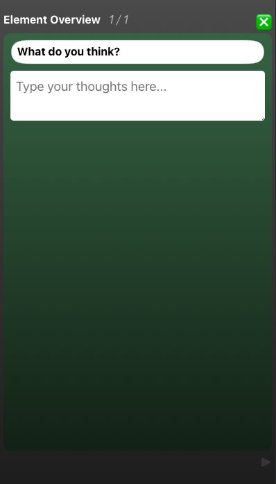
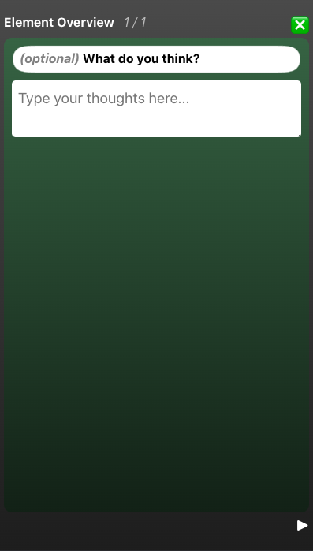
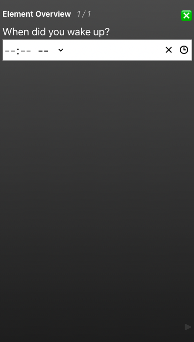
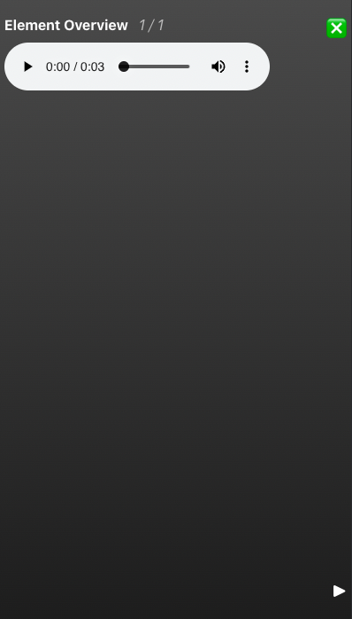
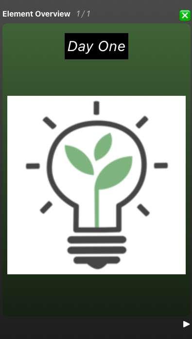

<style>img { width: 300px; } h3 { color:#888888;}</style>

# Element Overview

In [Creating Your First Habit](firsthabit.md) we explored the basics of creating a habit. In this section we will take a look at defining elements and their behaviors.

## Screens

A screenful of information is defined by a line in the data.md file, optionally followed by one of the special characters. For a full definition of all available types see below.

```
Here is an example of a message. This will be one the first screen.

Here is an example of another message. This will be on the second screen.

Here is a third line with an input. This will be on the third screen.

?

```

## Multiple Days

Supporting multiple days of content is very easy once you understand the basics. Its just a matter of adding more headers with two hashes `##`.

```
## Day One

How was your first day?

?

## Day Two

How was your second day?

?

## Day Three

How was your third day?

?
```

## Element Types

### Message

First, there are simple messages. These can be helpful for showing quotes, setting up ideas, explaining how to use a habit, reminders, and more. A message is defined by a simple line of text without any special characters on the following line.

```
Here is a message.
```


### Basic Prompt

These are basic prompts. The user is intended to write an answer to a question in this space. These prompts will show up in the final summary once the user has completed answering. The next button will be disabled until the user enters something.

```
What do you think?

?
```



### Hidden Prompt

Hidden Prompts are similar to Basic prompts, except the result is not added to the summary. This is helpful if the user is asking questions that might not generate a response that should be shared. We highly recommend testing and actually sharing the summaries of your habits to get a feel for whether you would want to use this prompt type or not.

```
What do you think?

??
```


### Optional Prompt

Optional Prompts are similar to Basic prompts, except they are not required. This can be helpful for repetitive questions, or questions to which there might not always be an answer.

```
What do you think?

?-
```



### Time Prompt

A time prompt is a prompt that asks the user to entire a time of day. This could be used as part of a sleep journal, or some productivity planning.

```
When did you wake up?

@
```



### Audio

An audio element is a screen that is an audio file. This could be used for a guided meditation, breathing exercise, or anything else that you would want to use audio for. No message is displayed on the screen. In order to add your audio, you will need to select both the `data.md` file, and the audio file in the create flow. They should be in the same folder, and the name in the parentheses should match the name in the folder.

```
[audio](myaudio.m4a)
```



### Image

An image element is a screen that is an image file. For bigger habits, we recommend images to break up the monotony pf text prompts. In order to add your images, you will need to select both the `data.md` file, and the image files in the create flow. They should be in the same folder, and the name in the parentheses should match the name in the folder.

```
[image](myimage.jpg)
```


