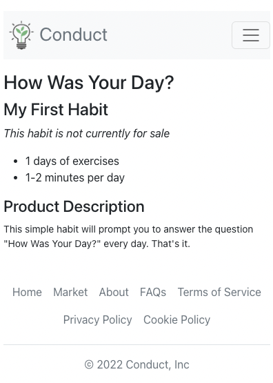
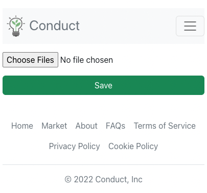
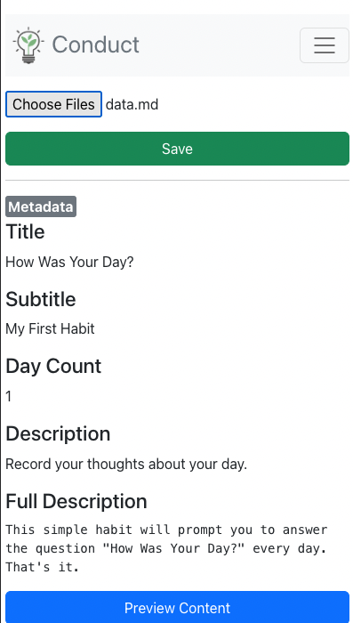
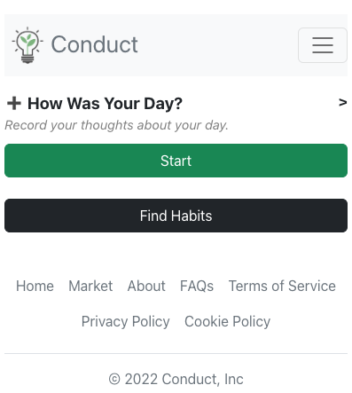

# Creating Your First Habit

This guide will explain how you can create habits and routines on Conduct. Conduct has a flexible content system, designed to combine differentiated daily content, prompts, audio, and interactive elements. Throughout this document, we will use the term "habit" and "routine" interchangeably to refer to a unit of content.

## Source Files

In order to provide as much flexibility as possible, we focused on using simple text files as the inputs for building habits. The source files for habits are based on [markdown](https://www.markdownguide.org/). Not all features of markdown are supported by Conduct, and Conduct has added some features to enable interactives and prompts. We will cover those below.

While editing in markdown may be unfamiliar to some people, we believe this is the right choice for the following reasons:

- The content you create will start and end in your control, and won't be tied up in a complicated UI.
- Editing and reviewing will be easy in one of the many markdown editors, or a simple text file editor.

## Creating

After creating an account on Conduct you will be able to create your content, by uploading it at https://conductapp.net/create.

### Example #1 - How was your day yesterday?

In this simple example, we will take a look at a habit that has one day of content. This habit will ask one question every day: "How was your day?"

1. Create a folder called "howwasyourday", or another name of your choosing.

2. Create a file named "data.md". Do not change this. In later steps, we will demonstrate uploading habits and images at the same time, and the name "data.md" is required for our system to find the root markdown file. Paste the following into data.md:

```
# How Was Your Day?

### Subtitle

My First Habit

### Description

Record your thoughts about your day.

### Full Description

This simple habit will prompt you to answer the question "How Was Your Day?" every day. That's it.

### Day Count

1

## Day One

How was your day?

?

```

### Metadata

Let's cover the metadata to start. All metadata uses 1 hash ("#") for the title or 3 hash ("###") for the other fields. The metadata is represented on the preview screen, which is what other users will see if you choose to share your habit. Here is how the preview screen looks for the "How Was Your Day?" habit:



Let's cover each field in detail:

```
# How Was Your Day?
```

The single `#` marks this line as the title of the habit. "How Was Your Day?" will be used to represent the habit throughout conduct, on the preview screen, on the home page, and at the top of the habit when using it.

```
### Subtitle

My First Habit
```

This subtitle is used in the preview page for public habits. You can see examples of subtitles by visiting different habits under [the market](https://conductapp.net/market).

```
### Description

Record your thoughts about your day.
```

The description will be used day to day on conduct to remind the user of the purpose of the habit. We find it helpful to set context on a habit before jumping into the activity.

```
### Full Description

This simple habit will prompt you to answer the question "How Was Your Day?" every day. That's it.
```

The "Full Description" is also used on the habit preview page under the market. This section can contain multiple paragraphs. At the moment we only support plain text.

```
### Day Count

1
```

This is also part of the preview page under the market. This allows you to set text like "30+" particularly if you are still workshopping the habit and editing the total number of days.

### Daily Content

Each day is marked by two hashes (`##`). Our habit only has one day to start. Let's go through each section:

```
## Day One
```

This will mark the start of a habit. For multiday habits, the text serves as a category to help introduce that day. For single-day habits, this text is not used.

```
How was your day?

?
```

These lines together mark a single screen of content. The text is the message that the user will be able to read. The single question mark indicates that there should be an input that the user is required to enter something into before proceeding.

There are several varieties of screens that you can create, each with it's own purpose. We will cover more in the reference section.

## Uploading

Uploading your habit requires creating an account and logging in if you haven't done that already. To start uploading, visit https://conductapp.net/create.



Use the file selector to choose the data.md file that you have created. If this is successful, you should see a preview of the habit below, starting with the metadata for the habit:



You can use the interactive preview for the habit to confirm that the days work as expected. Because we only have one day, the one day should just repeat over and over.

Once you are satisfied with this, you can press the save button.

You should be redirected to a screen that will allow you to add the habit.

### Swapping

Once you get to the phase of adding new versions of an existing habit, you will be given the option to swap the habit, which will transfer the history of an existing habit to your new one, and uninstall the old one. This can be helpful for longer multi day habits where losing your position will affect the qualitative experience in your use and testing.

## Confirm

If you've successfully added the habit, you should be able to go to the home screen and see the habit on your home page, ready to be used!



## Multiple Days

Supporting multiple days of content is very easy once you understand the basics. Its just a matter of adding more headers with two hashes `##`.

```
## Day One

How was your first day?

?

## Day Two

How was your second day?

?

## Day Three

How was your third day?

?
```

## Multiple Screens

Supporting multiple screens within a single day is easy as well. The full details are covered in the

```
## Day One

How was your first day?

?

## Day Two

How was your second day?

?

## Day Three

How was your third day?

?
```

## Conclusion

This covers the basic elements of creating and installing a habit. For more all options please take a look at [element overview](elementoverview.md).
